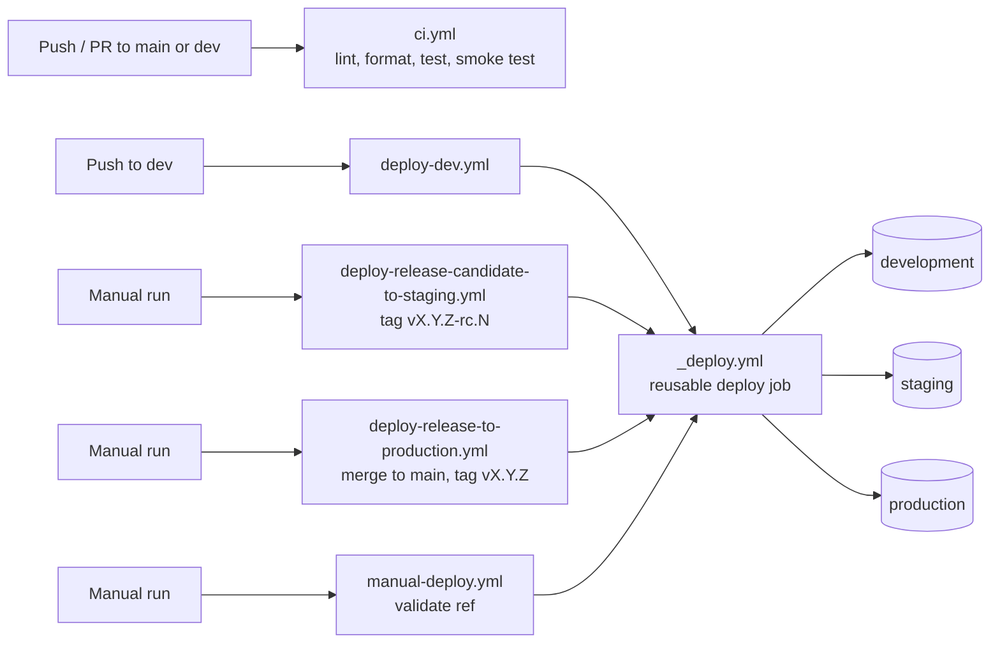

# ci-cd-example

Minimal Express API used as an example project for CI/CD setup.

## Usage

```bash
npm install
npm start          # listens on PORT (default 3000)
npm test           # run unit tests
npm run test:coverage
```

## API

`GET /` → `{ "message": "Welcome to the ci-cd-example API!", "dateTime": "2026-09-24T12:00:00.000Z" }`

`POST /sum` with JSON body `{ "a": 2, "b": 3 }` → `{ "result": 5 }`

Returns `400` if `a` or `b` is missing or not a finite number.

## Code quality

```bash
npm run lint           # ESLint, auto-fixes what it can
npm run lint:check     # ESLint, report only (used in CI)
npm run format         # Prettier, rewrite files
npm run format:check   # Prettier, fail if files are not formatted (used in CI)
npm test               # Jest unit tests (used in CI)
npm run test:coverage  # Jest with a coverage report in coverage/
npm run check          # lint:check + format:check + test, same checks as CI
```

Run `npm run check` before pushing: CI runs the same three checks (inside the `ci` Docker image) and fails on any of them.

| Tool     | Config             | Notes                                                                                                                                                                       |
| -------- | ------------------ | --------------------------------------------------------------------------------------------------------------------------------------------------------------------------- |
| ESLint   | `eslint.config.js` | `@eslint/js` recommended rules, Node globals (Jest globals in `tests/`), `eslint-config-prettier` so it never conflicts with Prettier; ignores `node_modules/`, `coverage/` |
| Prettier | `.prettierrc.json` | Single quotes, 100-character lines; ignores `node_modules/`, `coverage/`, `package-lock.json` (`.prettierignore`)                                                           |
| Jest     | `package.json`     | Node test environment; tests live in `tests/` (`app.test.js` uses Supertest against the Express app)                                                                        |

## Docker

```bash
docker build --target production -t ci-cd-example .
docker run --rm -p 3000:3000 ci-cd-example
```

Run the CI checks (lint, format, tests) in a container, the same way CI does:

```bash
docker build --target ci -t ci-cd-example:ci .
docker run --rm ci-cd-example:ci
```

## Docker Compose

`compose.yaml` needs `ENV`, `APP_NAME`, `APP_PORT` and `IMAGE_TAG`. Copy `.env.example` to `.env` and adjust, then:

```bash
docker compose -f compose.yaml up -d --build
docker compose -f compose.yaml logs -f
docker compose -f compose.yaml down
```

## CI/CD pipeline

All workflows live in `.github/workflows/` and run on **self-hosted Linux runners** with Docker installed.

### Design principle: minimal per-environment configuration

The pipeline is intentionally built so that config per environment differ as little as possible and centerlized in few places. Configuration lives in exactly three places:

| Where                              | What                                                                  | Changes                 |
| ---------------------------------- | --------------------------------------------------------------------- | ----------------------- |
| **Git (source code)**              | Application code, Dockerfile, `compose.yaml`, workflows               | With every commit       |
| **The `.env` file** on each server | Everything that makes one environment behave differently from another | Rarely, per environment |
| **GitHub repository settings**     | Environments, runners and repository variables                        | Once, when setting up   |

- **The `.env` file is the only difference between environments.** Development, staging and production run the same code, the same image build and the same deploy steps; the env file alone describes how the system behaves in each one.
- **Repository settings are fixed wiring, not behaviour.** They only say which runner deploys which environment and where its env file is; they don't change how the app works.
- **Everything else comes from Git.** Any other behaviour is defined in the source code, so it is versioned, reviewed and deployed like any other change, and a commit or tag fully describes what runs.
- **Servers stay simple.** A deploy machine needs only Docker, a registered runner and its env file; no hand-made setup to recreate or keep in sync.

When adding a setting, keep this split: if it differs between environments, put it in the env file (and `.env.example`); otherwise put it in the code.



| Workflow                                  | Trigger                                                      | What it does                                                                                                  |
| ----------------------------------------- | ------------------------------------------------------------ | ------------------------------------------------------------------------------------------------------------- |
| `ci.yml`                                  | Push or pull request to `main` / `dev`                       | Lint, format check, tests, then builds and smoke tests the production image                                   |
| `deploy-dev.yml`                          | Push to `dev`                                                | Deploys the pushed commit to **development**                                                                  |
| `manual-deploy.yml`                       | Manual (Actions → manual-deploy → Run)                       | Deploys any branch, tag or commit to the environment you pick                                                 |
| `create-release.yml`                      | Manual (Actions → create-release → Run)                      | Creates branch `release/vX.Y.Z` from `dev` with the version bumped in `package.json`                          |
| `create-patch.yml`                        | Manual (Actions → create-patch → Run)                        | Creates branch `patch/vX.Y.Z` from `main` with the patch version bumped in `package.json`                     |
| `deploy-release-candidate-to-staging.yml` | Manual (Actions → deploy-release-candidate-to-staging → Run) | Tags the head of `release/vX.Y.Z` or `patch/vX.Y.Z` as the next `vX.Y.Z-rc.N` and deploys it to **staging**   |
| `deploy-release-to-production.yml`        | Manual (Actions → deploy-release-to-production → Run)        | Fast-forwards `main` to `release/vX.Y.Z` or `patch/vX.Y.Z`, tags it `vX.Y.Z` and deploys it to **production** |
| `_deploy.yml`                             | Called by the four deploy workflows only                     | The shared deploy job                                                                                         |

### CI (`ci.yml`)

Runs on the runner labelled with the `CI_RUNNER` variable. A new push to the same ref cancels the previous run.

1. **checks**: builds the `ci` Docker target and runs `lint:check`, `format:check` and `test` inside it.
2. **build** (after checks pass): builds the `production` target, starts it on port 3000 and calls `POST /sum` with `{"a":2,"b":3}`, expecting `{"result":5}`. Logs are printed and the container is removed whatever the result.

Both jobs end with `docker image prune -a -f` (even on failure), which removes the images they built and any other unused image on the runner.

### Deploy job (`_deploy.yml`)

A [reusable workflow](https://docs.github.com/actions/using-workflows/reusing-workflows) that every deploy goes through. Inputs:

| Input         | Meaning                                            |
| ------------- | -------------------------------------------------- |
| `environment` | `development`, `staging` or `production`           |
| `ref`         | Commit (or branch/tag) to check out                |
| `image_tag`   | Docker image tag, passed to compose as `IMAGE_TAG` |

Steps:

1. Picks the runner for the environment: `DEVELOPMENT_RUNNER`, `STAGING_RUNNER`, or `PRODUCTION_RUNNER` for anything else.
2. Runs inside the GitHub environment, so its protection rules (e.g. required reviewers) and variables apply.
3. Checks out `ref` and verifies the environment's `ENV_FILE` variable is set and the file exists on the runner.
4. `docker compose build`, then `docker compose up -d --no-build --wait` (waits until the container is running).
5. Always prints the container logs and prunes unused images.

Deploys to the same environment never overlap: they share the `deploy-<environment>` concurrency group and queue instead of cancelling each other, whichever workflow started them.

### Development (`deploy-dev.yml`)

Every push to `dev` deploys that commit to **development** with image tag `dev-<commit sha>`. It does not wait for CI.

### Manual deploy (`manual-deploy.yml`)

Actions → **manual-deploy** → **Run workflow**, then choose:

- **environment**: any environment configured in the repo
- **ref**: a tag, branch or commit SHA (e.g. `v1.2.3`, `main`, `a1b2c3d`)

A **validate** job runs first on the target environment's runner. It rejects refs with characters outside `A-Z a-z 0-9 . _ / -`, then asks the GitHub API to resolve the ref to a full commit SHA and fails if no branch, tag or commit matches. The deploy then checks out that exact SHA, so a push to the branch while the run is queued doesn't change what gets deployed. The image tag is the ref with any character Docker doesn't allow replaced by `-` (e.g. `feature/x` → `feature-x`).

### Create a release (`create-release.yml`)

Actions → **create-release** → **Run workflow**, then choose **release_type**: `minor` or `major`.

1. Checks out `dev` with all tags and finds the last final release tag (`vX.Y.Z`; `-rc.N` tags are ignored, `v0.0.0` if there is none).
2. Increments it: `minor` → `vX.(Y+1).0`, `major` → `v(X+1).0.0` (e.g. `v1.0.5` → `v1.1.0` or `v2.0.0`).
3. Fails if that tag, or a branch `release/vX.Y.Z` or `patch/vX.Y.Z`, already exists.
4. Creates `release/vX.Y.Z` from `dev`, sets the version in `package.json` and `package-lock.json` with `npm version`, commits it as `chore(release): vX.Y.Z` and pushes the branch.

It runs on the CI runner and needs `contents: write` (set in the file). The branch only prepares the release: deploy it to staging with `deploy-release-candidate-to-staging.yml`, then merge it into `main` and deploy it to production with `deploy-release-to-production.yml`.

### Create a patch (`create-patch.yml`)

Actions → **create-patch** → **Run workflow** (no inputs). Works like `create-release.yml`, but for fixes to what is already released:

1. Checks out `main` with all tags and finds the last final release tag (`vX.Y.Z`, ignoring `-rc.N`).
2. Increments the patch number: `v1.0.5` → `v1.0.6`.
3. Fails if that tag, or a branch `patch/vX.Y.Z` or `release/vX.Y.Z`, already exists.
4. Creates `patch/vX.Y.Z` from `main`, sets the version with `npm version`, commits it as `chore(release): vX.Y.Z` and pushes the branch.

Both workflows share one concurrency group, so a release and a patch are never computed at the same time.

### Deploy a release candidate (`deploy-release-candidate-to-staging.yml`)

Actions → **deploy-release-candidate-to-staging** → **Run workflow**, then enter **version**, e.g. `v1.1.0` (`1.1.0` also works).

1. **tag** job (CI runner):
   - Fails if the version isn't `vX.Y.Z` or if the final tag `vX.Y.Z` already exists (already released).
   - Finds the branch for the version: `release/vX.Y.Z` or `patch/vX.Y.Z`. Fails if neither or both exist.
   - Fails if the branch's latest commit already has a `vX.Y.Z-rc.N` tag: there is nothing new to deploy. Push new commits first, or redeploy that tag with `manual-deploy.yml`.
   - Finds the highest existing candidate `vX.Y.Z-rc.N` and uses `N + 1` (`rc.1` for the first one).
   - Creates an annotated tag on the branch's latest commit and pushes it.
2. **deploy** job: deploys that commit to **staging** through `_deploy.yml`, with the rc tag as the image tag.

The tag job shares the concurrency group with `create-release.yml`, `create-patch.yml` and `deploy-release-to-production.yml`, so two runs never pick the same candidate number; the deploy itself queues in `deploy-staging` like every other staging deploy.

### Deploy a release to production (`deploy-release-to-production.yml`)

Actions → **deploy-release-to-production** → **Run workflow**, then enter **version**, e.g. `v1.1.0`.

1. **release** job (CI runner) checks that the release can go out, and fails with a clear error otherwise:
   - The version is `vX.Y.Z` and the tag `vX.Y.Z` doesn't exist yet.
   - Exactly one of `release/vX.Y.Z` and `patch/vX.Y.Z` exists.
   - The branch's latest commit has a `vX.Y.Z-rc.N` tag, i.e. that exact commit was deployed to staging with `deploy-release-candidate-to-staging.yml`.
   - `main` can be fast-forwarded to the branch: every commit on `main` is already in the branch. If not, merge or rebase `main` into the branch and deploy a new release candidate.

   Then it runs `git merge --ff-only` of the branch into `main`, creates the annotated tag `vX.Y.Z` on it and pushes `main` and the tag together (`git push --atomic`, so neither is pushed if the other is rejected).

2. **deploy** job: deploys that commit to **production** through `_deploy.yml`, with `vX.Y.Z` as the image tag. The `production` environment's protection rules (e.g. required reviewers) apply here.

Because `main` is fast-forwarded, production runs exactly the commit that was tested on staging. The built-in token pushes directly to `main`, so a branch protection rule on `main` that requires pull requests must allow GitHub Actions to bypass it. Pushes made with the built-in token don't trigger `ci.yml`.

### Release flow

```text
create-release (minor/major from dev)  ─┐
create-patch   (patch from main)       ─┴─> release/vX.Y.Z or patch/vX.Y.Z
  -> deploy-release-candidate-to-staging  (tag vX.Y.Z-rc.N, deploy to staging; repeat after each fix)
  -> deploy-release-to-production         (fast-forward main, tag vX.Y.Z, deploy to production)
```

### Setup

Everything the pipeline needs outside the code: runners, repository variables, environments and env files.

#### Overview

| Environment   | Deployed by                                       | Runner variable      | Image tag           | Env file             |
| ------------- | ------------------------------------------------- | -------------------- | ------------------- | -------------------- |
| `development` | push to `dev`, manual                             | `DEVELOPMENT_RUNNER` | `dev-<sha>` or ref  | `ENV_FILE` (env var) |
| `staging`     | `deploy-release-candidate-to-staging.yml`, manual | `STAGING_RUNNER`     | git tag or ref      | `ENV_FILE` (env var) |
| `production`  | `deploy-release-to-production.yml`, manual        | `PRODUCTION_RUNNER`  | git tag or ref      | `ENV_FILE` (env var) |
| _(none)_ CI   | push / PR to `main` or `dev`                      | `CI_RUNNER`          | `<sha>`, `ci-<sha>` | not used             |

#### Runners

Every job runs on a self-hosted runner and requires three labels: `self-hosted`, `linux`, and a custom label whose value is stored in a repository variable.

| Runner      | Label comes from     | Runs                                                                                                                                                                              |
| ----------- | -------------------- | --------------------------------------------------------------------------------------------------------------------------------------------------------------------------------- |
| CI          | `CI_RUNNER`          | `ci.yml` (checks and build jobs), `create-release.yml`, `create-patch.yml`, `deploy-release-candidate-to-staging.yml` (tag job), `deploy-release-to-production.yml` (release job) |
| Development | `DEVELOPMENT_RUNNER` | deploys to development, and the manual `validate` job for it                                                                                                                      |
| Staging     | `STAGING_RUNNER`     | deploys to staging, and the manual `validate` job for it                                                                                                                          |
| Production  | `PRODUCTION_RUNNER`  | deploys to production, and the manual `validate` job for it                                                                                                                       |

The runner **is** the deploy target: the app is started with Docker Compose on the machine the runner lives on. One machine can host several runners/labels, but each environment then needs its own `APP_PORT` and `ENV`.

Register a runner: Settings → Actions → Runners → **New self-hosted runner**, follow the download steps, then configure it with its label and install it as a service:

```bash
./config.sh --url https://github.com/<owner>/<repo> --token <token> --labels <label>
sudo ./svc.sh install && sudo ./svc.sh start
```

Each runner machine needs:

- Docker Engine with the Compose v2 plugin (`docker compose`, 2.1+ for `--wait`)
- The runner's user in the `docker` group
- `git` and `curl` (`curl` is used by the CI smoke test and by the manual `validate` job)
- Deploy runners: the env file at the path set in the environment's `ENV_FILE`, readable by the runner user
- CI runner: port `3000` free (the smoke test publishes it and names its container `app`)

Notes:

- Deploys run `docker image prune -a -f`, which removes **every** image on the machine not used by a container, not only this project's.

#### Repository variables

Settings → Secrets and variables → Actions → **Variables** tab → Repository variables.

| Variable             | Required by                                                                                                                       | Example             | Meaning                         |
| -------------------- | --------------------------------------------------------------------------------------------------------------------------------- | ------------------- | ------------------------------- |
| `CI_APP_NAME`        | `ci.yml`                                                                                                                          | `ci-cd-example`     | Image name for CI builds        |
| `CI_RUNNER`          | `ci.yml`, `create-release.yml`, `create-patch.yml`, `deploy-release-candidate-to-staging.yml`, `deploy-release-to-production.yml` | `ci-runner`         | Label of the CI runner          |
| `DEVELOPMENT_RUNNER` | `deploy-dev.yml`, `manual-deploy.yml`                                                                                             | `dev-runner`        | Label of the development runner |
| `STAGING_RUNNER`     | `deploy-release-candidate-to-staging.yml`, `manual-deploy.yml`                                                                    | `staging-runner`    | Label of the staging runner     |
| `PRODUCTION_RUNNER`  | `deploy-release-to-production.yml`, `manual-deploy.yml`                                                                           | `production-runner` | Label of the production runner  |

The runner variables must be **repository** variables, not environment variables: `runs-on` is resolved before the job enters its environment. An unset runner variable leaves the job waiting forever for a runner with an empty label.

No secrets are used. Workflows only need the built-in `GITHUB_TOKEN`, with the permissions set in each file (`contents: read` for CI and deploys, `contents: write` to push branches, tags and `main`); the manual `validate` job uses it to resolve the ref through the GitHub API.

#### Environments

Settings → Environments → **New environment**. Create exactly these names (the workflows and the runner mapping use them):

- `development`
- `staging`
- `production`

On **each** environment add an environment variable:

| Variable   | Example                   | Meaning                                                            |
| ---------- | ------------------------- | ------------------------------------------------------------------ |
| `ENV_FILE` | `/opt/ci-cd-example/.env` | Absolute path of the env file on that environment's runner machine |

If it is missing or the file doesn't exist, the deploy fails at **Check env file exists**.

Upcoming protection rules (per environment):

- **Required reviewers**: a deploy waits for approval before it starts. Recommended for `production`.
- **Wait timer**: delay before a deploy starts.
- **Deployment branches and tags**: limit which refs may deploy. Note that for `manual-deploy.yml` GitHub checks the branch the workflow was run from ("Use workflow from"), not the `ref` input.

Only environments that exist in the repo appear in the manual deploy dropdown. Any environment other than `development` and `staging` uses `PRODUCTION_RUNNER`, so adding a new one also means adding it to the runner mapping in `_deploy.yml` and `manual-deploy.yml`.

#### Env files

One file per environment, stored on its runner machine outside the repository (at the `ENV_FILE` path), following `.env.example`:

```bash
ENV=production          # compose project and container name become <APP_NAME>-<ENV>
APP_NAME=ci-cd-example  # also the image name: <APP_NAME>-<ENV>:<IMAGE_TAG>
APP_PORT=3000           # host port mapped to the container's 3000
```

| Key         | Required | Notes                                                                          |
| ----------- | -------- | ------------------------------------------------------------------------------ |
| `ENV`       | yes      | Use the environment name; must differ between environments on the same machine |
| `APP_NAME`  | yes      | Project name                                                                   |
| `APP_PORT`  | yes      | Must be unique per environment on the same machine                             |
| `IMAGE_TAG` | no       | Set by the workflow; overrides any value in the file                           |
